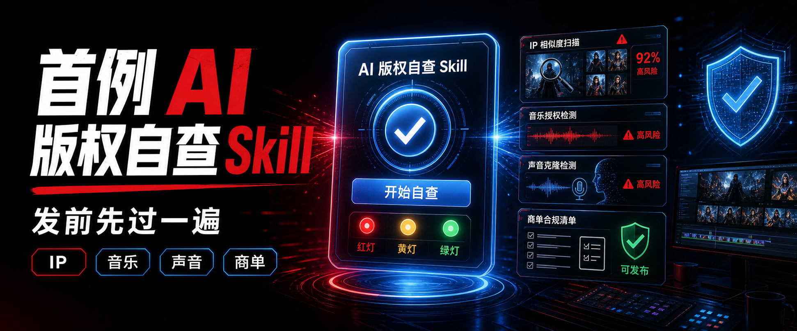
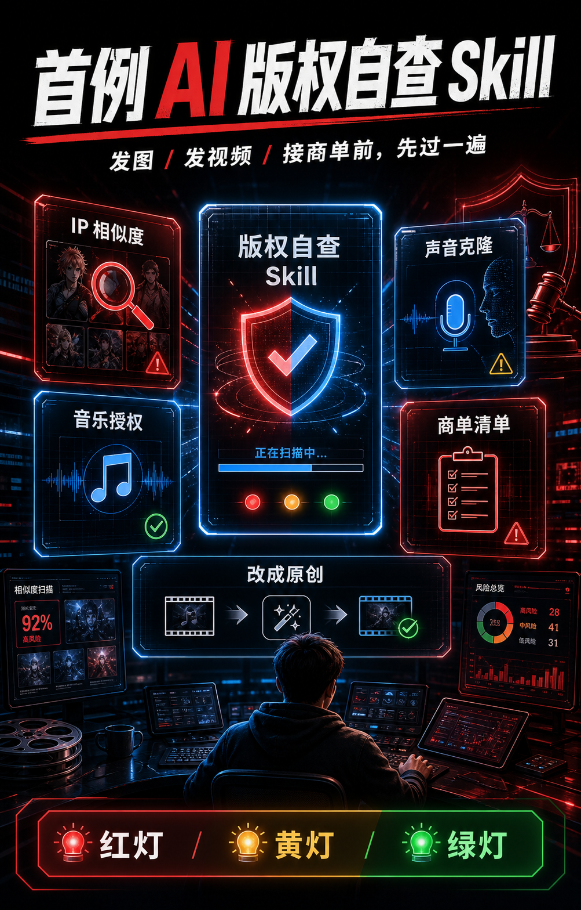

# AI Copyright Self Check Skill

首例面向 AI 创作者的版权自查 Codex Skill。复制、安装、重启 Codex，就能用它检查 AI 图、AI 视频、同人二创、商单、BGM、AI 翻唱、声音克隆的发布风险。



## 30 秒安装

```bash
git clone https://github.com/dongmingxuan2012-crypto/ai-copyright-self-check-skill.git
cd ai-copyright-self-check-skill
bash install.sh
```

然后重启或刷新 Codex，直接发送：

```text
用 $ai-copyright-self-check 帮我检查这个 AI 视频能不能发商单。
```

如果你不想运行脚本，也可以手动复制：

```bash
mkdir -p ~/.codex/skills
cp -R ai-copyright-self-check ~/.codex/skills/
```

## 马上试一次

把下面这段复制给 Codex：

```text
用 $ai-copyright-self-check 检查这个作品：

类型：AI 生图提示词
用途：发在 X 上，引流到我的 AI 课程
内容：一个金发刺猬头少年，橙黑忍者服，额头金属护额，脸上三道胡须纹，手里搓蓝色旋转能量球，背景有九尾狐火焰，热血少年漫风格
授权：没有角色授权，没有官方素材授权
我想知道：能不能直接发？哪里最危险？怎么改成原创？
```

它应该输出红灯 / 黄灯 / 绿灯结论、风险表、修改建议和发布前 checklist。

## 能检查什么



- AI 图 / AI 视频是否太像具体 IP、角色、logo、影视作品
- 同人 / 二创内容是否进入商用高危区
- BGM、平台曲库、AI 翻唱、声音克隆是否有授权风险
- 真人脸、名人声音、声纹和肖像相关风险
- 商单、带货、课程、客户交付前需要保留哪些授权证据
- 如何把“像某个 IP”改成“受启发的原创”

## 适合谁

- AI 图文、AI 视频、AI 短片创作者
- 接商单、做课程、带货、做品牌内容的人
- 经常做同人、二创、混剪、AI 翻唱、声音克隆的人
- 发布前想要一个“先别翻车”的自查流程的人

## 输出什么

默认输出：

- 红灯 / 黄灯 / 绿灯风险结论
- 主要风险点表格
- 可执行修改建议
- 发布前 checklist
- 创作者能听懂的最终建议

## 输入模板

信息越完整，检查越准：

```text
用 $ai-copyright-self-check 检查我的作品。

类型：
用途：
发布平台：
是否商用/商单/课程/带货：
作品描述或文件：
参考素材来源：
音乐/BGM/配音来源：
是否用了真人脸、名人声音、角色名、logo：
我已有的授权证据：
我最担心的问题：
```

也可以直接附图、视频、脚本或提示词，让 Codex 先看作品再判断。

## 示例报告

- [动漫同人压力测试：火影忍者高度指向案例](examples/anime-naruto-risk-test.md)
- [快速测试输入模板](examples/quick-start-case.md)

## 仓库结构

```text
ai-copyright-self-check/
  SKILL.md                    # skill 主说明
  agents/openai.yaml          # Codex UI 元信息
  references/                 # 风险矩阵、同人/IP、音乐声音、商单、改原创
examples/
  anime-naruto-risk-test.md   # 动漫同人压力测试报告
  quick-start-case.md         # 可复制测试输入
assets/                       # 海报和文章配图
install.sh                    # 一键安装脚本
```

## 更新

重新拉取仓库后再跑一次安装脚本即可：

```bash
git pull
bash install.sh
```

脚本会把旧版本备份成 `ai-copyright-self-check.backup-时间戳`，再安装新版本。

## 免责声明

本 skill 提供创作者发布前的实操风险自查，不构成法律意见。遇到高价值商单、争议通知、诉讼风险或复杂授权，请咨询专业知识产权律师。
